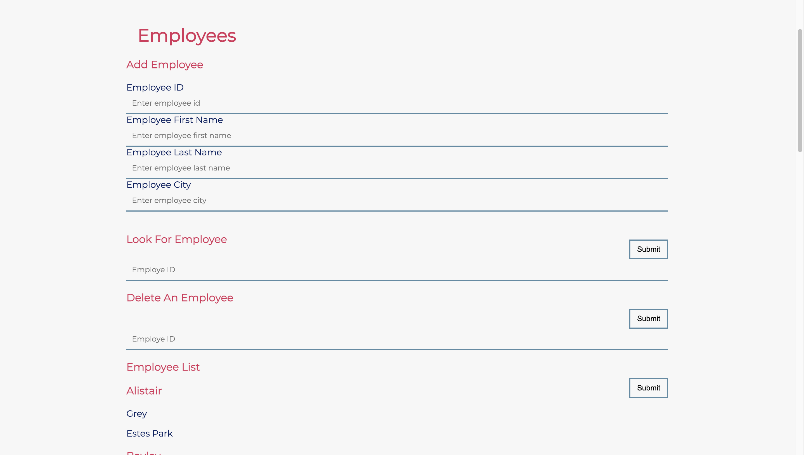

# Full Stack Drills
This is a project I completed as a student at [hackreactor](http://hackreactor.com).

## Tech Stack
React, CSS, Express.js, Axios, MySQL

## Server API

Objectives

- Create a server and database that responds to the specified RESTful routes

**React app can refactor using Data From the Server API**

  - View all employees from the server
  - View a specific employee from the server

**Server is handling these routes and connected to MYSQL Database**

| METHOD | PATH               | DESCRIPTION                                          |
| ------ | ------------------ | ---------------------------------------------------- |
| GET    | /api/employees     | respond with all the employees                       |
| GET    | /api/employees/:id | respond with single employee, based on req.params.id |
| POST   | /api/employees     | inserts new employeee record from req.body           |
| PATCH  | /api/employees/:id | update an employee record from req.body              |
| DELETE | /api/employees/:id | delete an employee record                            |

